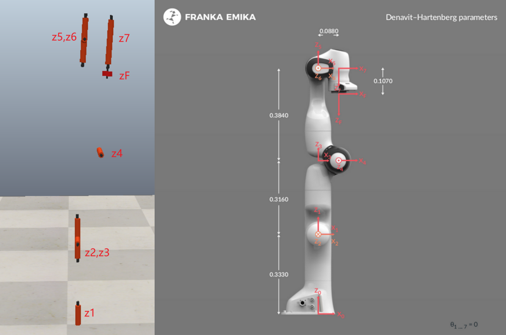
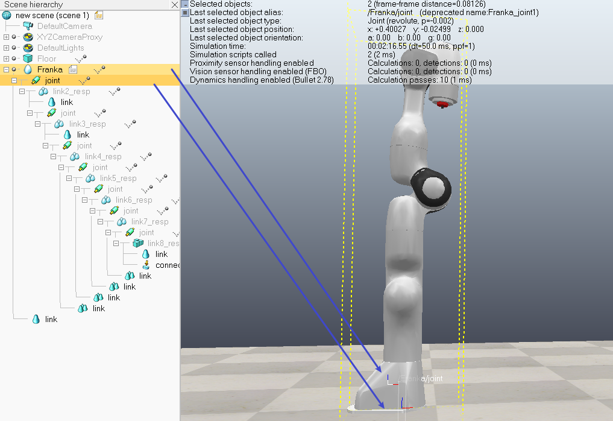
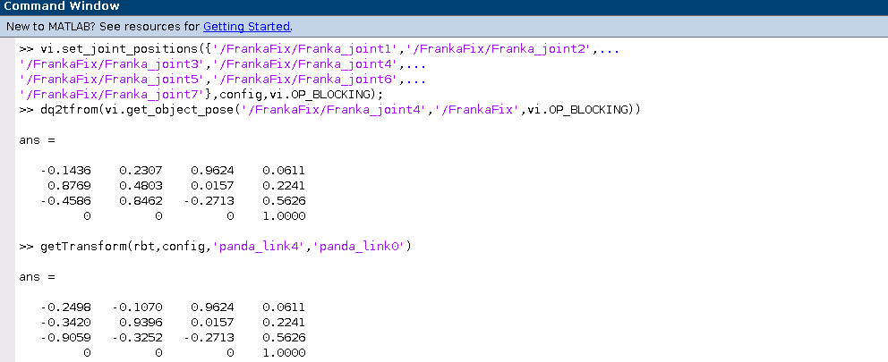
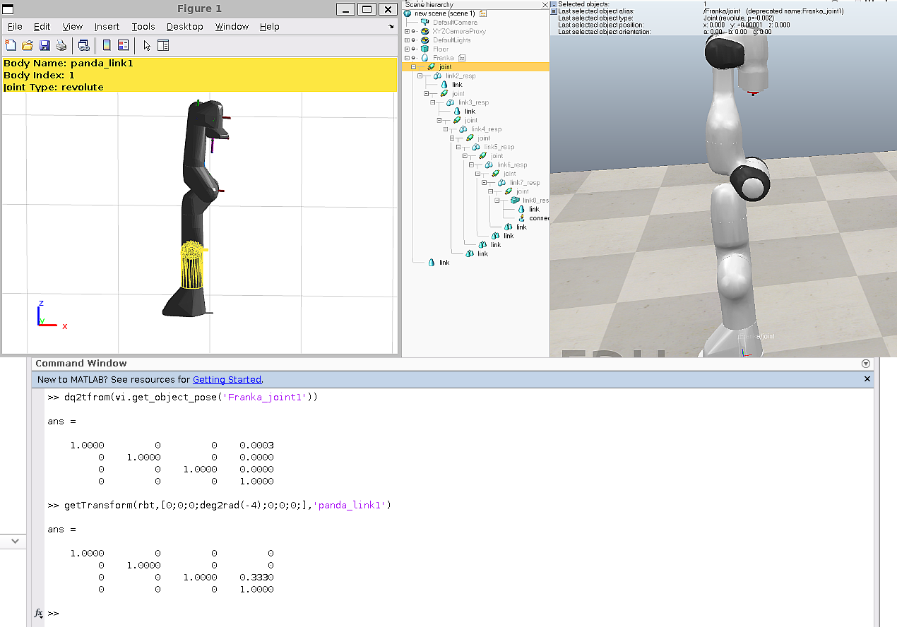
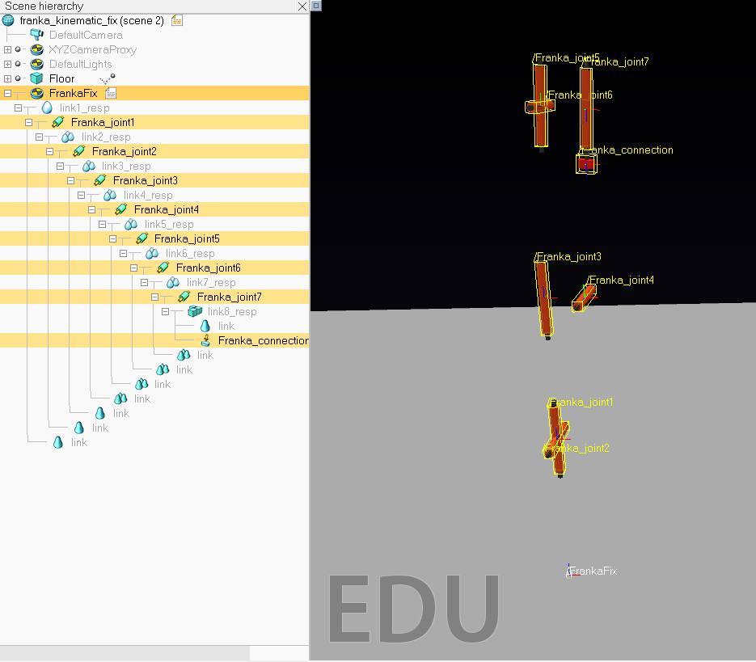
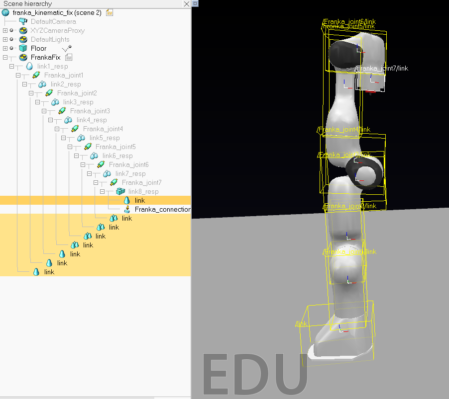
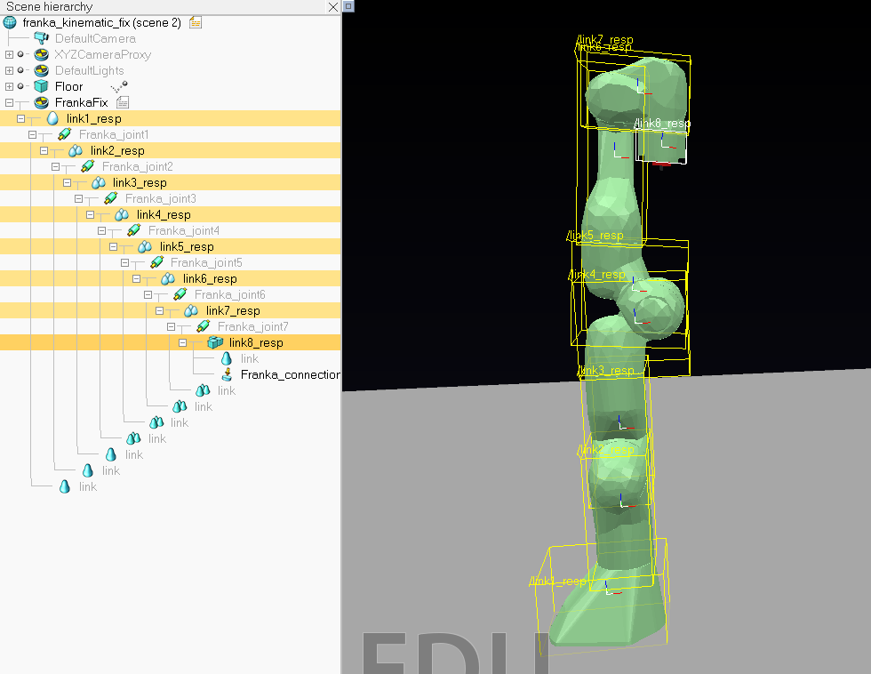

# Modefication Details

## What is the problem?

The current Franka model in CoppeliaSim has a problem with the joint definition, which does not match the official Franka DH table. Specifically, joint 1 and 3 are not in the positions specified by the official DH table.

Additionally, the model's first component ("/Franka") is bound to a shape model instead of a frame on the robot base, further adding to the confusion. Mistakenly using this coordinate as the relative frame can result in an unexpected shift, whereas the correct approach is to acquire the transformation relative to the first joint.

Also, the process of acquiring the relative frame is not very intuitive, which may also cause confusion during simulation. See [usage analysis](https://github.com/hwyao/CoppeliaSim_Franka_ModelFix/blob/main/docs/usage_analysis.md) for details.

## When might a problem occur?

There may be a problem when attempting to obtain the pose of a joint directly from the simulator using the CoppeliaSim remote API. Please note that this issue has only been verified with MATLAB. The API for other programming languages is unverified.

For example, when you use DQ robotics toolbox, you assign the robot kinematic DH on your own, which is normally copied from the [official Website](https://frankaemika.github.io/docs/control_parameters.html#denavithartenberg-parameters). Therefore, when using function like `fkm(q,1)` that directly calculate from you DH input, the result is correct. Matlab function `getTransform(rbt,q,'panda_link1')` also outputs the same result.

However, if you suddenly decide to read the joint position from the `DQ_VrepInterface`. For example calling `get_object_position('Franka/Franka_joint1')`, the result would then be inconsistent. The raw api function provided in `remApi.m` provides the same result.

## How to solve the problem?

### Modifications

1. This model is edited from the "robot/non-mobile/FrankaEmikaPanda.ttm" in the Model Browser.

2. The joint z1 and z3 is adjusted to the correct position based on the official DH parameters.

3. Joint is renamed as `Franka_joint[1-7]`, while the links retain their original names.

4. A dummy `FrankaFix` is added and set as the base of the model.    
> Now everything is intuitive. You can use `/FrankaFix/Franka_joint[1-7]` to refer to each joint and obtain their pose relative to base `/FrankaFix` as the base.

5. The LUA script attached to the model has been retained. The joint names is corrected to align with the changes made in step 3. The `moveToConfig()` function is commented out.

6. The joint is set in kinematic mode, and the entire robot body is not respondable and not dynamic (to match the usage of dqrobotics). More variations could be considered in future.

### Name after modification

### Unit Test and Interface

From here and [usage analysis](https://github.com/hwyao/CoppeliaSim_Franka_ModelFix/blob/main/docs/usage_analysis.md), we can note that the confusion mostly comes from the inconsistency between the behavior of the function and what we expect in our mind. This inconsistency may come from model corruption, different conventions of different functions, or even bugs in your program. When a problem occur, any point on this long execution chain could be suspicious.

Therefore a unit test and a interface is introduced. If you suspect that an external function works unreliably, executing a unit test can quickly verify your doubts. Also, the unit test and the corresponding interface is a demonstration of how to achieve same effect with different functions.
