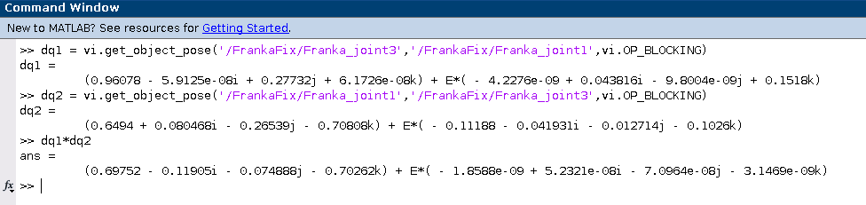
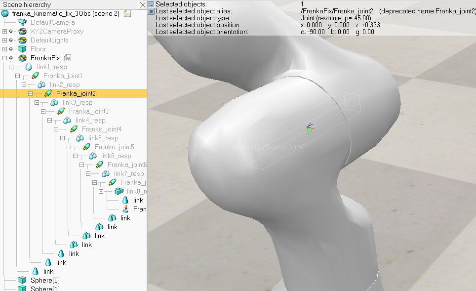
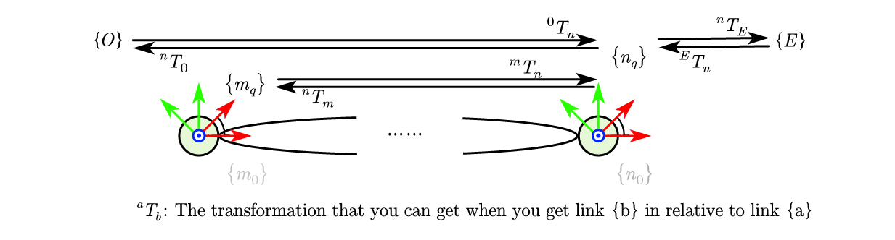
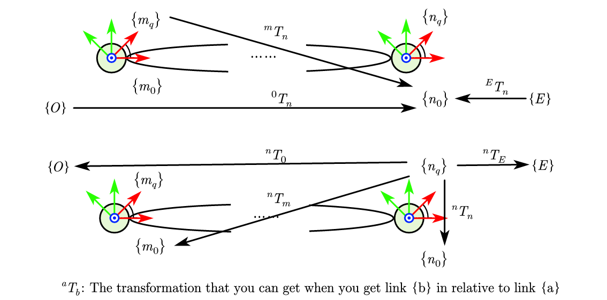

# Usage Analysis

## This happens even if you fix the model ...

Wait... Why they still can't match?

What? They are not the inverse of each other?

## Attention: two frames for a joint 

We can notice that in CoppeliaSim, a joint actually have two coordinate frames. One considers the current joint angle, another does not. This is where the inconsistency comes from.

## Getting transformation

For joint $n$, we define frame $\{n_0\}$ that exclude the current joint angle and $\{n_q\}$ that include the current joint angle.

### Usual convention

Normally, for the frame of link $n$, we refers to the frame $\{n_q\}$ that include the current joint angle rotation. This is how Matlab Robotics System Toolbox [getTransform()](https://www.mathworks.com/help/robotics/ref/rigidbodytree.gettransform.html) and dqrobotics `fkm()` works.

### CoppeliaSim convention

For CoppeliaSim, if a joint $n$ is used as the relative frame, the frame with joint angle $\{n_q\}$ is used. In constrast, if a joint $n$ is the target frame, $\{n_0\}$ is used. This is how official CoppeliaSim [Matlab API](https://www.coppeliarobotics.com/helpFiles/en/remoteApiFunctionsMatlab.htm) `simxGetObjectPosition` `simxGetObjectQuaternion ` and the Interface wrapped by dqrobotics `DQ_VrepInterface` works.

### Conversion with Interface

After understanding the how these functions works, we now can convert between different convention. 

An interface [FrankaInterface](https://github.com/hwyao/CoppeliaSim_Franka_ModelFix/blob/main/src/robots/FrankaInterface.m) is defined. We can select the convention with parameter `includeCurrent`. Now different classed inheriting from `FrankaInterface` could be now an good showcase of how these function works. And their result is compared with the official.

The implementations are:
- [FrankaMatlab](https://github.com/hwyao/CoppeliaSim_Franka_ModelFix/blob/main/src/robots/FrankaMatlab.m): usual convention, provided by Matlab Robotics System Toolbox.
- [FrankaDQ](https://github.com/hwyao/CoppeliaSim_Franka_ModelFix/blob/main/src/robots/FrankaDQ.m): usual convention, provided by DQ robotics
- [FrankaVrepDQ](https://github.com/hwyao/CoppeliaSim_Franka_ModelFix/blob/main/src/robots/FrankaVrepDQ.m): coppeliaSim API, wrapped by DQ robotics
- [FrankaVrepRaw](https://github.com/hwyao/CoppeliaSim_Franka_ModelFix/blob/main/src/robots/FrankaVrepRaw.m): coppeliaSim official API.

Paramater `includeCurrent = true` implements the usual convention, while `includeCurrent = false` implements the coppelia convention. 